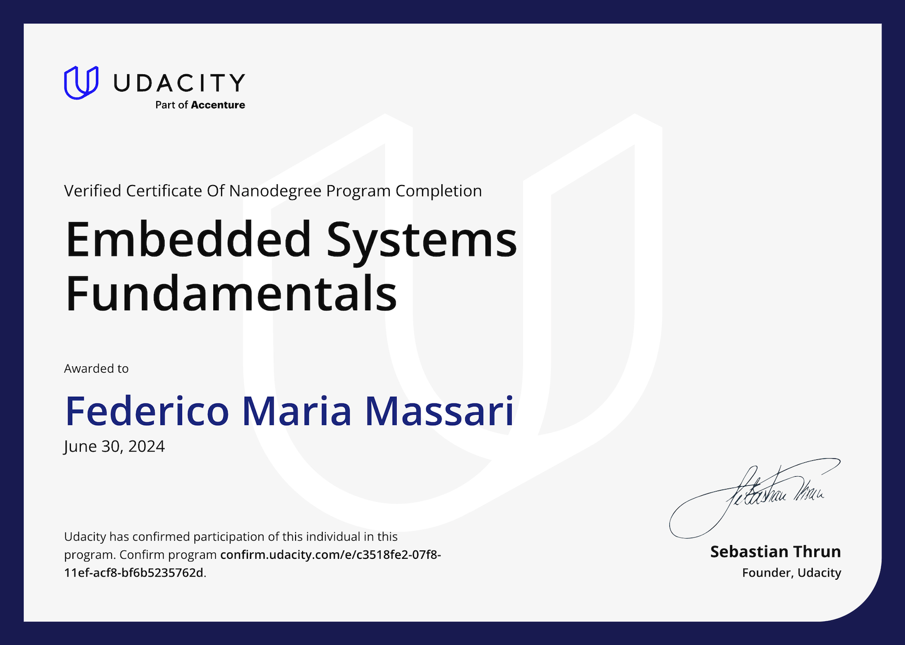
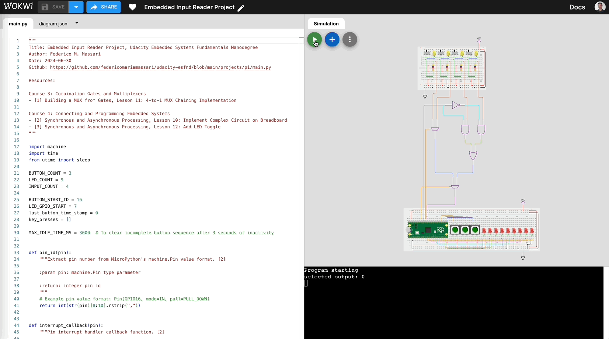

# Udacity Embedded Systems Fundamentals Nanodegree

## [Certificate of Completion](https://www.udacity.com/certificate/e/c3518fe2-07f8-11ef-acf8-bf6b5235762d)

# Core Projects

## [Project: Embedded Input Reader]()

__Acquired familiarity with:__ Wokwi, MicroPython, Raspberry Pi Pico.

### Overview

### Output

